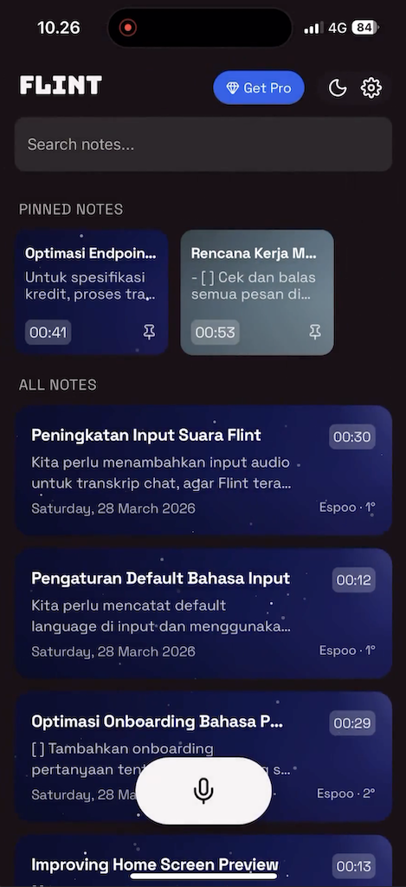
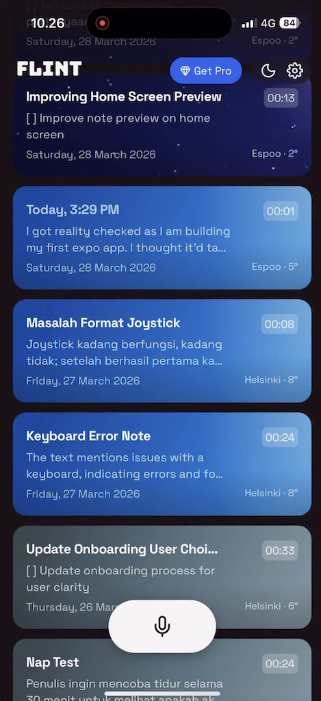

What if you can record the "vibe" as you record your note?

See the weather as your note background and feel the moment. Was the night clear when you thought about your groceries?

This is a feature I shipped for [Flint](https://flintvoice.app) — a voice note app I'm building. Instead of just capturing words, it now captures context: the weather at the moment you recorded the note becomes part of the note itself.

The idea is simple but surprisingly meaningful in practice. Looking back at a note and seeing "clear night, 18°C" alongside your thought transports you back to that moment in a way plain text never could.

